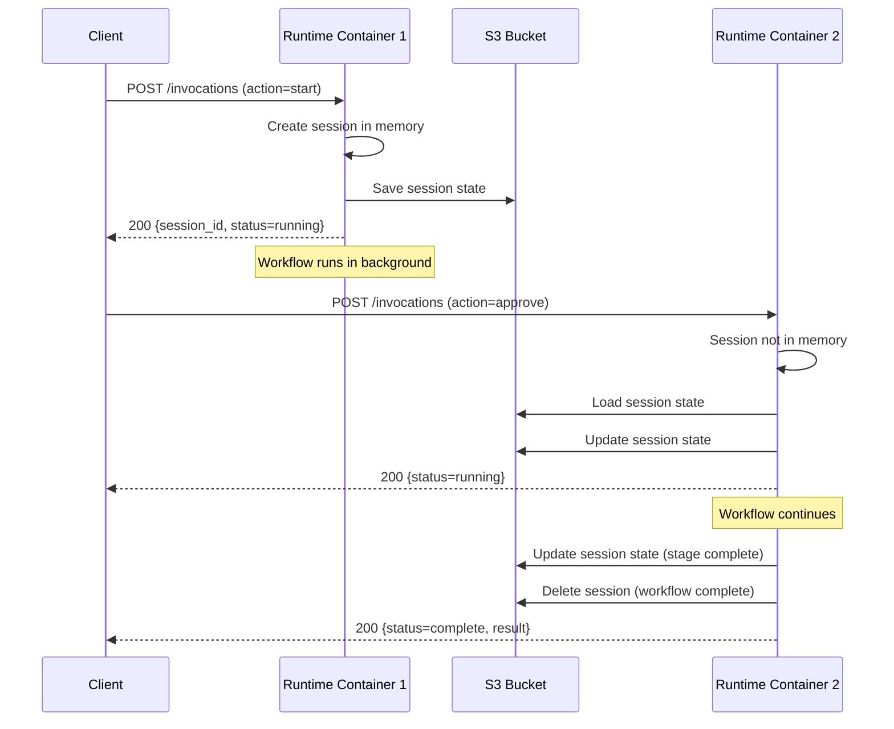

# AgentCore S3 Session Persistence - Deployment Guide

## Problem Solved

Deployed AgentCore workflows were timing out with "Session not found" errors after a few minutes because sessions stored in the runtime's `/tmp` directory were lost when:
- Runtime container recycled
- Different container handled subsequent invocations
- Idle timeout occurred

**Solution**: S3-backed session persistence enables workflows to run for long durations across container boundaries.

## Important: Local Development vs Deployed AgentCore

**Default behavior has changed**:
- ✅ **Local development** (`agentcore dev`): S3 persistence is **OFF by default** (`USE_S3_PERSISTENCE=false`)
- ⚠️ **Deployed AgentCore Runtime**: You **MUST** set `USE_S3_PERSISTENCE=true` explicitly

This prevents the S3 client from hanging during local development when AWS credentials aren't configured.

---

## Prerequisites

### 1. Create S3 Bucket

```bash
aws s3 mb s3://aidlc-agentcore-sessions --region us-east-1
```

**Bucket configuration**:
- **Versioning**: Optional (recommended for debugging)
- **Lifecycle policy**: Recommended to auto-delete sessions older than 1 day

Example lifecycle policy:
```json
{
  "Rules": [
    {
      "Id": "DeleteOldSessions",
      "Status": "Enabled",
      "Expiration": {
        "Days": 1
      },
      "Filter": {
        "Prefix": "sessions/"
      }
    }
  ]
}
```

Apply with:
```bash
aws s3api put-bucket-lifecycle-configuration \
  --bucket aidlc-agentcore-sessions \
  --lifecycle-configuration file://lifecycle.json
```

---

### 2. Configure IAM Permissions

The AgentCore Runtime execution role needs S3 access.

**Required permissions**:
```json
{
  "Version": "2012-10-17",
  "Statement": [
    {
      "Effect": "Allow",
      "Action": [
        "s3:PutObject",
        "s3:GetObject",
        "s3:DeleteObject"
      ],
      "Resource": "arn:aws:s3:::aidlc-agentcore-sessions/sessions/*"
    },
    {
      "Effect": "Allow",
      "Action": [
        "s3:ListBucket"
      ],
      "Resource": "arn:aws:s3:::aidlc-agentcore-sessions",
      "Condition": {
        "StringLike": {
          "s3:prefix": "sessions/*"
        }
      }
    }
  ]
}
```

**Apply to AgentCore Runtime execution role**:
```bash
# Option 1: Create inline policy
aws iam put-role-policy \
  --role-name AIDLCAgentCoreExecutionRole \
  --policy-name S3SessionPersistence \
  --policy-document file://s3-policy.json

# Option 2: Attach managed policy (if you create one)
aws iam attach-role-policy \
  --role-name AIDLCAgentCoreExecutionRole \
  --policy-arn arn:aws:iam::ACCOUNT_ID:policy/AIDLCSessionPersistence
```

---

### 3. Update AgentCore Environment Variables

⚠️ **CRITICAL**: You **MUST** explicitly enable S3 persistence for deployed AgentCore.

Add to AgentCore Runtime function configuration:

```bash
# REQUIRED: Enable S3 persistence (default is false for local dev)
USE_S3_PERSISTENCE=true

# S3 bucket name for session storage
SESSION_BUCKET=aidlc-agentcore-sessions
```

**Via AWS CLI**:
```bash
aws lambda update-function-configuration \
  --function-name aidlc-agentcore \
  --environment "Variables={SESSION_BUCKET=aidlc-agentcore-sessions,USE_S3_PERSISTENCE=true,AWS_REGION=us-east-1}"
```

**Via Bedrock Agent console**:
1. Navigate to your AgentCore Runtime
2. Edit → Environment variables
3. Add `SESSION_BUCKET` and `USE_S3_PERSISTENCE`
4. Save

---

## How It Works

### Session Lifecycle



### Session Storage Format

**S3 Key**: `sessions/{session_id}.json`

**Example**:
```json
{
  "session_id": "abc123",
  "repo": "kiro-sandbox/services/python-processor",
  "story": "As an API consumer, I want a filter action",
  "model_id": "us.anthropic.claude-haiku-4-5-20251001-v1:0",
  "auto_approve": true,
  "pending_stage": null,
  "completed_stages": ["workspace-detection", "reverse-engineering"],
  "final_result": null,
  "error": null,
  "session_metrics": {
    "input_tokens": 25000,
    "output_tokens": 8500,
    "cache_read_tokens": 12000,
    "cache_creation_tokens": 2900
  }
}
```

---

## Testing After Deployment

### 1. Start Workflow

```bash
RESPONSE=$(agentcore invoke '{
  "action": "start",
  "repo": "kiro-sandbox/services/python-processor",
  "story": "As an API consumer, I want a filter action",
  "model_id": "us.anthropic.claude-haiku-4-5-20251001-v1:0",
  "auto_approve": true
}')

SESSION=$(echo $RESPONSE | jq -r '.session_id')
echo "Session: $SESSION"
```

### 2. Verify S3 Session Created

```bash
aws s3 ls s3://aidlc-agentcore-sessions/sessions/ | grep $SESSION
# Should show: sessions/{session_id}.json
```

### 3. Check Session Contents

```bash
aws s3 cp s3://aidlc-agentcore-sessions/sessions/$SESSION.json - | jq .
```

### 4. Poll for Completion (Across Container Boundaries)

```bash
# Wait 2-3 minutes
sleep 180

# Check status (may hit different container)
agentcore invoke "{\"action\":\"approve\",\"session_id\":\"$SESSION\"}" | jq '.status'
# Expected: "running" or "complete" (not "error")
```

### 5. Verify Session Cleanup

```bash
# After workflow completes
aws s3 ls s3://aidlc-agentcore-sessions/sessions/ | grep $SESSION
# Expected: No output (session deleted on completion)
```

---

## Troubleshooting

### Session Not Found (Even with S3)

**Check**:
1. S3 bucket exists and is accessible
2. IAM role has correct permissions
3. `SESSION_BUCKET` environment variable matches actual bucket name
4. Runtime has network access to S3 (VPC configuration)

**Debug command**:
```bash
# Check if session was ever created
aws s3 ls s3://aidlc-agentcore-sessions/sessions/ --recursive

# Check CloudWatch logs for S3 errors
aws logs tail /aws/lambda/aidlc-agentcore --follow
```

---

### Workflow Still Times Out

**Cause**: Runtime 15-minute timeout is hard limit.

**Workaround**: Break large stories into smaller units or use Step Functions for orchestration.

---

### S3 Costs

**Estimate** (1000 workflows/month):
- **Storage**: 1000 sessions × 5KB × $0.023/GB-month = $0.12/month
- **Requests**: 
  - PUT: 1000 start + 10000 updates = 11000 × $0.005/1000 = $0.055
  - GET: 10000 status checks × $0.0004/1000 = $0.004
  - DELETE: 1000 completions × $0.005/1000 = $0.005
- **Total**: ~$0.18/month (negligible)

---

## Rollback (Disable S3 Persistence)

If S3 persistence causes issues, disable with:

```bash
aws lambda update-function-configuration \
  --function-name aidlc-agentcore \
  --environment "Variables={USE_S3_PERSISTENCE=false}"
```

**Note**: This reverts to in-memory sessions (15-minute limit, container-local only).

---

## Summary

✅ **What changed**: Sessions now persist to S3 across Runtime container boundaries

✅ **What to deploy**:
1. Create S3 bucket (`aidlc-agentcore-sessions`)
2. Add IAM permissions to Runtime execution role
3. Set `SESSION_BUCKET` environment variable
4. Deploy updated `agentcore_entrypoint.py`

✅ **What to test**: Start workflow, check S3 for session file, poll status after 2-3 minutes

✅ **Expected result**: No more "Session not found" errors for workflows running 5-15 minutes
